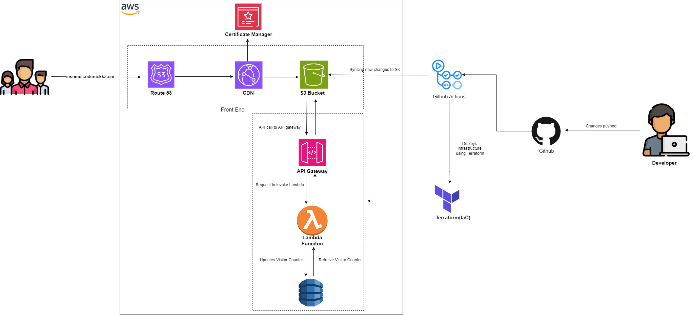

# Cloud Resume Challenge

The <a href = 'https://cloudresumechallenge.dev/docs/the-challenge/aws/'>cloud resume challenge</a> is a popular, hands-on project created by **Forrest Brazeal**, a cloud architect and advocate,to help aspiring cloud professionals gain real-world experience with cloud technologies. This challenge isn’t just another technical exercise — it’s designed to push you to combine your technical skills in a way that mirrors the actual responsibilities of a cloud engineer.

## What's this project about?

At its core, this challenge involves creating a personal resume website that's fully deployed using cloud services. It was created by Forrest Brazeal to help people demonstrate real-world cloud skills beyond just certifications.

**The key aspects of the Cloud Resume Challenge include:**
    1. Building a complete web application with both frontend and backend components
    2. Using cloud services like AWS, Azure, or GCP to host your resume
    3. Implementing DevOps practices like Infrastructure as Code and CI/CD pipelines
    4. Working with serverless functions and databases
    5. Setting up networking components like custom domains and CDNs
 

What makes this challenge valuable is that it touches on many different cloud technologies and practices that employers look for, but in a project small enough that one person can complete it. By the end, you'll have not just learned about cloud services, but actually implemented them in a real-world application that you can show to potential employers.

## Architecture
