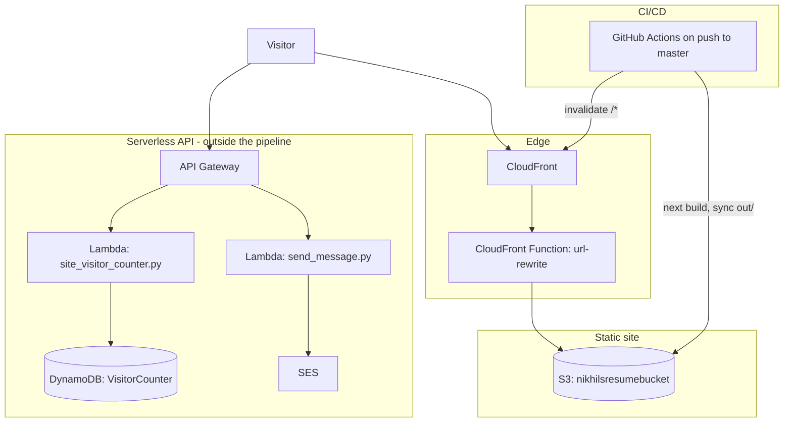

# aws-cloud-resume

The [Cloud Resume Challenge](https://cloudresumechallenge.dev/), built on AWS and still running.
Live at **[codenickk.com](https://codenickk.com)**.

A statically-exported Next.js site on S3 behind CloudFront, plus two Python Lambdas behind API
Gateway — a DynamoDB visitor counter and an SES contact form. Push to `master` and GitHub Actions
builds, syncs and invalidates. Default branch is **`master`**.

## Architecture


```mermaid
flowchart TD
    visitor["Visitor"]

    subgraph edge["Edge"]
        cf["CloudFront"]
        fn["CloudFront Function: url-rewrite"]
    end

    subgraph site["Static site"]
        s3[("S3: nikhilsresumebucket")]
    end

    subgraph api["Serverless API - outside the pipeline"]
        apigw["API Gateway"]
        counter["Lambda: site_visitor_counter.py"]
        contact["Lambda: send_message.py"]
        ddb[("DynamoDB: VisitorCounter")]
        ses["SES"]
    end

    subgraph ci["CI/CD"]
        gha["GitHub Actions on push to master"]
    end

    visitor --> cf
    cf --> fn
    fn --> s3
    visitor --> apigw
    apigw --> counter
    counter --> ddb
    apigw --> contact
    contact --> ses
    gha -->|"next build, sync out/"| s3
    gha -->|"invalidate /*"| cf
```

## Stack

| Layer | What |
|---|---|
| Frontend | Next.js 16 (App Router), React 19, TypeScript, Tailwind v4, shadcn `base-nova`, GSAP + Motion |
| Hosting | S3 with an OAC'd REST origin, CloudFront, one CloudFront Function for routing |
| Backend | Python Lambdas behind API Gateway, DynamoDB, SES |
| CI/CD | GitHub Actions — Node 22, build and sync on push to `master`, region `ap-south-1` |

## Layout

```
aws-cloud-resume
├── web/                        Next.js app — the whole frontend
│   ├── app/                    App Router pages; static export to web/out/
│   ├── components/             visitor-counter.tsx, contact-form.tsx, UI
│   └── lib/projects.ts         all project content, as a typed Project[]
├── handlers/
│   ├── site_visitor_counter.py DynamoDB counter, CORS via an origin allowlist
│   └── send_message.py         contact form, sends through SES
├── infra/cloudfront/           CloudFront Function attach procedure
└── .github/workflows/deploy.yml
```

`web/lib/projects.ts` is the single source of project content — `generateStaticParams()` builds
`/projects/<slug>` from it, so a new project is a new entry there and nothing else.

The Lambdas are **not in the pipeline**. There is no packaging or deploy step for them: edit the
file here, upload to Lambda by hand, keep the two copies in sync.

## Running it

Everything npm runs in `web/`:

```sh
npm ci
npm run dev      # localhost:3000
npm run build    # emits web/out/
npm run lint
```

There are no tests. `npm start` is meaningless for a static export — don't reach for it.

## Deploying

Push to `master`. [`deploy.yml`](.github/workflows/deploy.yml) builds `web/` and syncs it. The
manual equivalent, from the repo root:

```sh
aws s3 sync web/out/ s3://nikhilsresumebucket --delete \
  --exclude "__next.*" \
  --exclude "apps/*"

aws cloudfront create-invalidation --distribution-id E1PNSO5QUYT69 --paths "/*"
```

Two things about that command are load-bearing:

- **`--exclude "apps/*"` must stay.** `apps.codenickk.com` is served from the `apps/` prefix of
  this same bucket — it has to be, because that host shares the distribution's default cache
  behaviour with the apex and a behaviour has exactly one origin. This build knows nothing about
  `apps/`, so `--delete` reads the whole prefix as stray and removes it. That took the apps index
  down twice in one day, and the bucket has no versioning to restore from.
- **The `url-rewrite` CloudFront Function must stay published.** A static export emits
  `<route>/index.html`, and an OAC'd S3 REST origin answers **403, not 404**, for a missing key —
  so without the rewrite filling in `index.html`, every subroute 403s instead of falling back.

The copy of `url-rewrite.js` in `infra/cloudfront/` is a **reference copy and is stale**. The
authoritative source of the deployed function lives with the `apps.codenickk.com` landing page;
publishing this one silently breaks that host and the `resume.codenickk.com` redirect.

## Notes

- Bucket, distribution ID, region and the two API Gateway endpoints are hardcoded and committed
  deliberately — there are no environment variables and no secrets in this repo. The only secrets
  are the two AWS keys in GitHub Actions.
- The contact form's API Gateway integration is **non-proxy**, so `contact-form.tsx` unwraps a
  `{statusCode, body}` envelope. Simplifying that away means changing the integration first.
- `site_visitor_counter.py` reflects the request origin from an explicit allowlist rather than
  `*`. Adding a domain means editing the set and re-uploading the function.
- `resume.codenickk.com` 301s to the apex and must keep doing so — that URL is in job
  applications already sent.

## Credit

The challenge itself is [Forrest Brazeal](https://cloudresumechallenge.dev/)'s.

[](https://x.com/forrestbrazeal)
[](https://github.com/forrestbrazeal)
